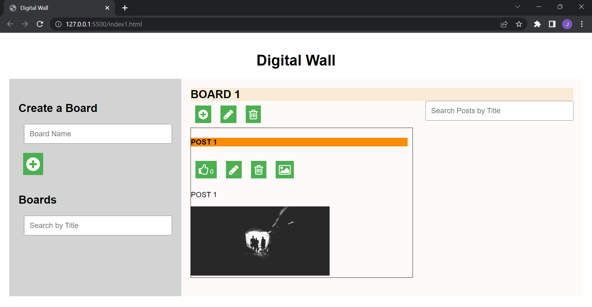
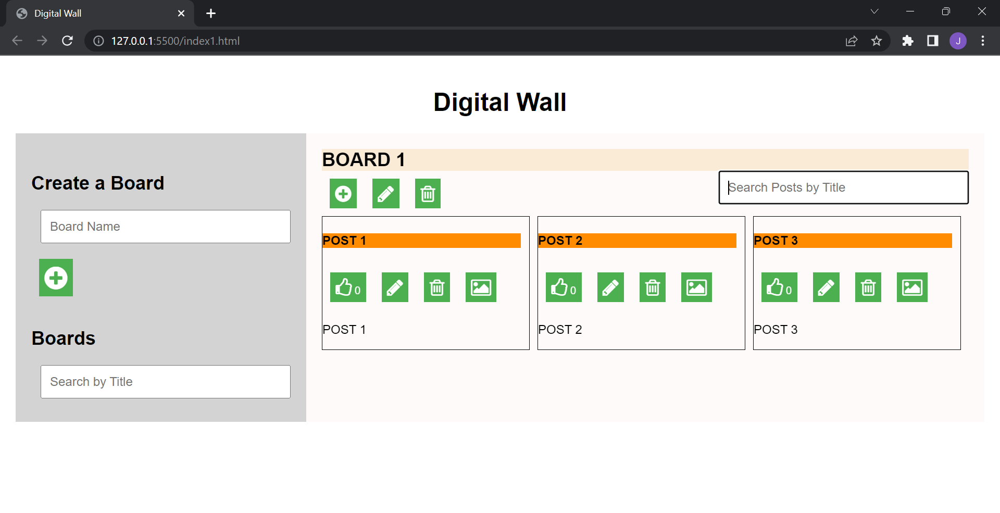

# Digital Wall

Digital Wall is a web application that allows users to create boards and post content on them. It provides a collaborative space where users can organize and share information.

## Features

- Create boards with custom names.
- Add posts to boards with titles and content.
- Update and delete posts.
- Like posts to show appreciation.
- Search boards and posts by title.

## Demo
   <a href="http://digitalwall.rf.gd/?i=1">digitalWall</a>

## Technologies Used

- HTML
- CSS
- JavaScript

## Usage

1. Clone the repository:

git clone https://github.com/anchitgupta01/DigitalWall.git

2. Open the index.html file in your preferred web browser.

3. Use the provided interface to create boards, add posts, and interact with the application.

## Screenshots

 
    

## Contributing

Contributions are welcome! If you find any issues or have suggestions for improvements, please open an issue or submit a pull request.

